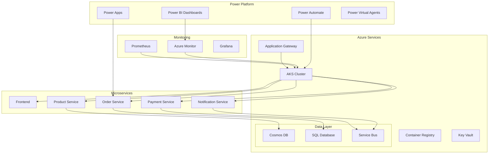

# Azure E-Commerce Platform 🚀
## Panagiotis 'Pano' Georgiadis
[](https://sonarcloud.io/dashboard?id=azure-ecommerce)
[](LICENSE)
[](https://azure.microsoft.com)

A production-ready, cloud-native e-commerce platform built on Microsoft Azure, demonstrating enterprise DevOps practices and modern cloud architecture patterns.

## 🌟 Key Features

### Architecture
- **Microservices**: 5 containerized services (Frontend, Product, Order, Payment, Notification)
- **Container Orchestration**: Azure Kubernetes Service (AKS) with auto-scaling
- **Service Mesh**: Istio for advanced traffic management (optional)
- **API Gateway**: Azure Application Gateway with WAF
- **Databases**: Azure Cosmos DB, Azure SQL Database
- **Messaging**: Azure Service Bus, Event Hubs

### DevOps Excellence
- **CI/CD**: Multi-stage pipelines with Azure DevOps & GitHub Actions
- **IaC**: Complete Bicep templates with Template Specs
- **GitOps**: Flux CD integration for Kubernetes deployments
- **Security**: Container scanning, SAST/DAST, secret management with Key Vault
- **Monitoring**: Prometheus, Grafana, Azure Monitor, Application Insights

### Power Platform Integration
- **Power BI**: Real-time operational dashboards and analytics
- **Power Apps**: Admin portal and mobile applications
- **Power Automate**: Automated workflows for approvals and alerts
- **Power Virtual Agents**: AI-powered customer support chatbots

## 🏗️ Architecture Overview



## 🚀 Quick Start

### Prerequisites
- Azure Subscription
- Azure CLI (>= 2.50.0)
- kubectl (>= 1.28)
- Docker Desktop
- Helm 3
- PowerShell 7+ or Bash
- Power Platform license (for Power Platform features)

### Deployment

```bash
# Clone the repository
git clone https://github.com/yourusername/azure-ecommerce-platform.git
cd azure-ecommerce-platform

# Login to Azure
az login
az account set --subscription "Your-Subscription-Name"

# Deploy infrastructure (Dev environment)
./scripts/deploy-infrastructure.sh dev eastus

# Build and push containers
./scripts/build-services.sh

# Deploy to AKS
./scripts/deploy-services.sh dev

# Setup monitoring
./scripts/setup-monitoring.sh
```

## 📁 Repository Structure

```
├── .azuredevops/          # Azure DevOps pipeline definitions
├── .github/               # GitHub Actions workflows
├── infrastructure/        # Infrastructure as Code
│   ├── bicep/            # Bicep templates and modules
│   ├── template-specs/   # Azure Template Specs
│   └── scripts/          # Deployment scripts
├── services/             # Microservices source code
│   ├── frontend/         # React frontend
│   ├── product-service/  # Python/FastAPI
│   ├── order-service/    # Node.js/Express
│   ├── payment-service/  # Python/Flask
│   └── notification-service/
├── kubernetes/           # Kubernetes manifests
│   ├── deployments/
│   ├── services/
│   ├── configmaps/
│   └── monitoring/
├── power-platform/       # Power Platform solutions
│   ├── power-bi/
│   ├── power-apps/
│   ├── power-automate/
│   └── power-virtual-agents/
├── scripts/              # Automation scripts
│   ├── automation/
│   └── monitoring/
├── docs/                 # Documentation
└── examples/             # Example configurations
```

## 🛠️ Technologies Used

### Cloud Platform
- Azure Kubernetes Service (AKS)
- Azure Container Registry (ACR)
- Azure Cosmos DB
- Azure SQL Database
- Azure Service Bus
- Azure Key Vault
- Azure Monitor
- Azure Application Gateway

### Development
- **Languages**: Python, TypeScript, JavaScript, C#
- **Frameworks**: FastAPI, Express.js, React, .NET
- **Containerization**: Docker, Docker Compose
- **Orchestration**: Kubernetes, Helm
- **IaC**: Bicep, ARM Templates

### DevOps Tools
- Azure DevOps Pipelines
- GitHub Actions
- Prometheus & Grafana
- SonarQube
- Trivy Security Scanner
- OWASP Dependency Check

### Power Platform
- Power BI (Dashboards)
- Power Apps (Canvas & Model-driven)
- Power Automate (Workflows)
- Power Virtual Agents (Chatbots)
- Dataverse

## 📊 Monitoring & Observability

The platform includes comprehensive monitoring:

- **Metrics**: Prometheus + Grafana dashboards
- **Logging**: Azure Monitor Logs with KQL queries
- **Tracing**: Application Insights with distributed tracing
- **Alerting**: Azure Monitor Alerts + Power Automate notifications
- **Real-time Analytics**: Power BI streaming datasets

## 🔒 Security Features

- Container image scanning with Trivy
- Secret management with Azure Key Vault
- Network policies in Kubernetes
- WAF rules on Application Gateway
- RBAC for Kubernetes and Azure resources
- Managed identities for service authentication
- TLS encryption for all communications
- Regular security patching automation

## 📈 Performance

- Horizontal Pod Autoscaling (HPA)
- Vertical Pod Autoscaling (VPA)
- Cluster autoscaling with AKS
- Redis caching layer
- CDN integration for static assets
- Database query optimization
- Async processing with Service Bus

## 🤝 Contributing

We welcome contributions! Please see our [Contributing Guide](CONTRIBUTING.md) for details.

1. Fork the repository
2. Create your feature branch (`git checkout -b feature/AmazingFeature`)
3. Commit your changes (`git commit -m 'Add some AmazingFeature'`)
4. Push to the branch (`git push origin feature/AmazingFeature`)
5. Open a Pull Request

## 📝 License

This project is licensed under the MIT License - see the [LICENSE](LICENSE) file for details.

## 🙏 Acknowledgments

- Microsoft Azure documentation
- Kubernetes community
- Power Platform community
- All contributors who have helped shape this project

## 📞 Support

- **Documentation**: [Wiki](https://github.com/yourusername/azure-ecommerce-platform/wiki)
- **Issues**: [GitHub Issues](https://github.com/yourusername/azure-ecommerce-platform/issues)
- **Discussions**: [GitHub Discussions](https://github.com/yourusername/azure-ecommerce-platform/discussions)

## 🏆 Showcase

This project demonstrates:
- ✅ Enterprise-grade microservices architecture
- ✅ Complete DevOps automation
- ✅ Infrastructure as Code best practices
- ✅ Cloud-native design patterns
- ✅ Power Platform integration
- ✅ Production-ready monitoring and alerting
- ✅ Security-first approach
- ✅ Scalable and resilient design

---

**Built with ❤️ using Microsoft Azure and Power Platform**
